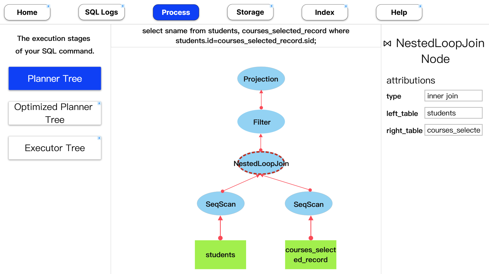
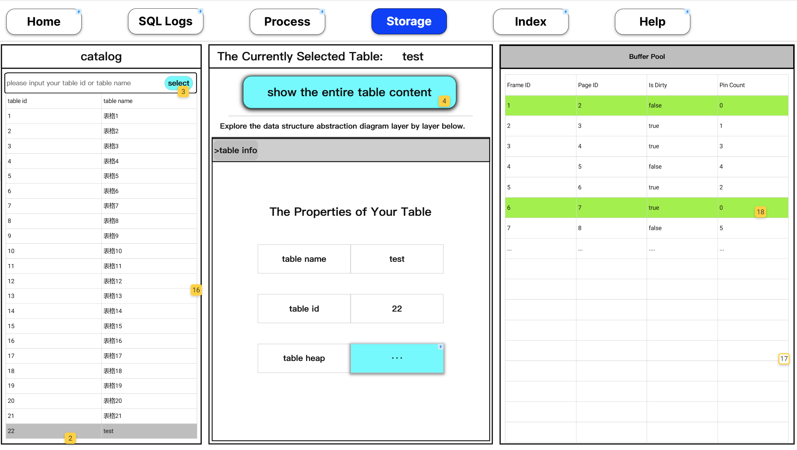

# BusTubTracer 详细设计文档

开发小组：A7小组（BusTubTracer Project）

编写日期：2024.11.16

# 技术规格

目标平台：Linux Ubuntu 22.04

是否需要联网：本产品为离线工具类桌面软件，使用时不需要联网。

# 整体技术架构

经过前期技术调研，本产品所使用的技术框架确定如下：

- **前端图形化界面**：采用**Vue3框架**进行搭建，使用JavaScript开源可视化库**D3.js**实现关键的图表绘制功能。
- **桌面软件封装框架**：采用**Electron框架**将前端代码封装为可供用户直接使用的桌面软件。
- **数据库核心**（BusTubCore）：基于**CMU BusTub**直接进行二次修改和开发。

此外，本产品的技术实现中涉及到两个不同的进程，即展示图形化界面的Electron框架进程，以及真正实现RDBMS功能的数据库核心（BusTubCore）进程。如何处理好这两个进程之间的通信问题，是本产品技术架构设计阶段必须考虑的问题。

考虑到Electron框架内置了**Node.js API**，可以直接通过前端的JavaScript代码来调用Linux操作系统提供的系统服务，并且BusTubCore作为纯C/C++开发的Linux程序，也可以直接调用操作系统所提供的服务，我们决定在Electron进程和BusTubCore进程之间建立持久性的半双工本地**Unix Domain Socket**连接，来实现进程间通信。

具体来说：

1. 当用户启动BusTubTracer前端应用后，前端JS代码会通过Node.js API拉起BusTubCore进程，并与之建立本地Socket连接，为后面响应用户操作奠定基础。
2. 当用户在前端界面上执行操作（比如执行一条SQL命令）后，前端JS代码会将用户操作按一定规则（见后文"BusTubCore接口设计"）组织成**JSON数据流**的形式，并利用Node.js API将这些数据经由Socket管道发送给BusTubCore进程。而后，前端应用进入阻塞等待状态。
3. BusTubCore进程始终监听Socket管道上是否有请求消息。当收到来自前端应用的请求JSON后对JSON内容进行解析，并**执行实际的数据库操作**。待操作完成后，BusTubCore将响应消息也按照一定的规则组织成**JSON数据流**的形式，再通过Socket管道发还给前端应用。
4. 当前端应用收到响应JSON后，解除阻塞等待状态，将结果信息在图形化界面中展示给用户。同时BusTubCore恢复监听状态，等待来自前端应用的下一次请求。

# 成员分工&已有技术储备

针对开发团队中不同同学所掌握的技术栈和兴趣方向，我们进行了如下分工：

- BusTubCore后端开发：王江轶、徐熠、郑翔

- 前端开发：徐翊蓝（前端技术主管）、刘芷悠、张鑫鑫、张佳欣、马生力

- 前后端通信功能开发：王江轶、徐翊蓝、徐熠、郑翔

- 后期测试：刘芷悠、张鑫鑫、张佳欣、马生力

截至目前，我们开发团队已经拥有了如下的技术储备：
- 王江轶、徐熠、郑翔三位同学已经对原版BusTub的开源C/C++代码进行了较为仔细的阅读和分析，基本掌握了BusTub关系型数据库系统的内部工作原理和关键数据结构，可以较好地胜任对其源代码进行二次修改开发的工作。
- 徐翊蓝同学能够较为熟练地使用Vue3框架进行前端开发，并且已经学习了解过关于RDBMS底层工作原理的相关理论知识，能够与后端同学进行较好的协作，并带领团队中其他同学完成本产品的前端开发工作。

# 前端UI设计

我们团队采用墨刀进行前端UI设计，在线查看链接https://modao.cc/proto/ArwXWTELsmv8lcZWKV5852?view_mode=read_only

## Welcome界面设计

该界面为应用启动后最先看到的页面。


说明：

1. 上方导航栏的"Process"默认处于无法点击的非激活状态。
1. 点击"Sumbit"按钮，将用户输入的SQL命令提交给后端执行。当执行完毕或遇到错误后，后端返回结果，前端需要弹窗进行展示。若执行成功，则激活上方导航栏的"Process"按钮，同时更新"SQL Logs"面板和"Process"面板的数据。

## SQL Logs界面设计

该界面展示了用户历次提交的SQL命令，及其执行情况。


## Process界面设计

Process界面展示用户提交的SQL命令在BusTub内部被处理和执行的情况，对应**BusTub SQL Execution层内部工作过程展示**这个开发需求。

左侧导航栏选项"Planner Tree"和"Optimized Planner Tree"所指向的页面，除数据源（一个是初始的Planner Tree，一个是经优化后的Planner Tree）不同外，页面布局和显示逻辑是完全一致的。如下图所示：



说明：

1. 页面中间面板上的树状图节点可以被用户点击选中，而后触发右侧面板渲染更新。
1. 右侧面板初始时默认为空，直到用户选中中间面板的某个树状图节点，则显示附着在该节点上的关键信息。

至于左侧导航栏选项"Executor Tree"所指向的页面，则稍有不同。如下图所示：


说明：

1. 中间面板中树状图所展示的每一个Executor节点，都与Optimized Planner Tree上的一个plan节点相对应。
1. 在右侧面板中，"plan attribution"这里只需要再把optimized planner tree上对应节点的信息显示一下就行了。
1. 当选中一个executor节点，右侧面板的"input tables"项显示流入该executor节点的数据，
1. 类似地，"output tables"显示从该节点流出的数据。

## Storage界面设计

Storage界面用于显示BusTub内部数据表的存储结构，对应**BusTub Storage层内部存储存储结构展示**这一条开发需求。

其整体布局设计如下：



### 左侧面板及中间上方子面板

说明：
1. 初次进入该界面时，**中间显示面板为空**。左侧"catalog"面板中会罗列出当前存储在数据库系统中的所有数据表名。
1. 用户鼠标单击左侧"catalog"面板上的某一行，即可选中某一个具体的数据表，同时**触发中间面板渲染更新**。
1. 用户在左侧"catalog"面板上方的输入框中输入想要选中数据表的表名或者ID号，同样可以选中列表中的某一行。这个设计主要是为了改善用户体验（特别是在已有数据表非常多的情况下），并且该功能完全依赖前端实现，并不需要后端添加接口。
1. 双击"catalog"列表中的某一项，会弹出一个弹窗，用于展示该数据表的表格内容（即所有记录的信息）。
1. 选中"catalog"面板中的某一列，再点击中间面板的"show the entire table content"按钮，也可弹出上一条所述的面板。

### 中间面板下方子面板

中间面板下侧的子面板设计较为复杂。总体而言，其仿照Windows资源管理器中`Breadcrumb Navigation`的设计，方便用户在数据表不同的存储结构视图之间切换，以求改善用户的交互体验。

首先，当用户在左侧"catalog"面板中选中某一张数据表后，中间面板首先会显示`Table Info`视图。该视图代表了该数据表在数据库系统中内部存储的一些基本信息。如下图所示：


用户可以点击图中蓝色的`...`按钮以进一步查看`Table Heap`数据结构的视图。如下图所示：


在`Table Heap`视图上，用户可以直观地看到一个数据表中的内容是由多个`Table Page`所组成的，且使用一个双向链表将它们组织起来。

此外，当进入`Table Heap`后，可以看到面板导航栏（图中灰色区域）发生了变化。通过点击导航栏中的`>table info`项，用户可以便捷地退回到上一级的`Table Info`视图，这就是所谓的`Breadcrumb Navigation`。**这个设计在接下来用户进一步深入查看不同层级的视图时，同样有效，故下文不再重复叙述！**

在`Table Heap`视图中，用户可以继续点击蓝色的`...`按钮，以进一步进入`Table Page`视图：


说明：
1. `Table Page`视图中分为`Header`、`Free Space`和`Tuple Array`三块区域，与实际数据库系统中内存页的布局结构相对应。其中区域标题右侧的`Size=...B`处显示在实际的内存页中，这块区域所占用的字节数。该信息由后端接口提供。
1. `Header`区显示该`Table Page`内存页的关键头信息。
1. `Free Space`区不包含任何实际内容，仅代表该内存页中可分配的剩余空间大小。
1. `Tuple Array`区罗列了存储在该内存页中所有`Tuple`（记录）。点击右侧的蓝色`...`按钮，可以进一步进入`Tuple`视图查看详细信息。

`Tuple`视图的设计如下图所示：


说明：
1. `Tuple`视图被划分为`properties`和`data`两部分。
1. `properties`区域用于展示该条记录的一些元信息，例如数据库系统是否已为其分配了内存、其在内存页中所占的字节数等等。
1. `data`区域用于罗列该条记录内部所包含的各个不同的字段值（`Value`）。点击右侧的蓝色`...`按钮，可查看相应字段值的`Value`视图。

`Value`视图用于展示某个字段值的具体信息，其设计如下图所示：


### 右侧面板

右侧面板用于展示数据库系统内部实际缓冲池的内存页分配情况。


说明：
1. 面板中的这四列分别表示缓冲池中某个内存页在缓冲池内部的实际ID号、逻辑页号、是否为脏页和被引用次数。这些数据均有后端返回。
1. 如果某个内存页处于空闲状态，可以被分配，则前端代码将该列标记为绿色。
1. 由于在实际的数据库系统中缓冲池内有大量的内存页，需要为这个面板添加一个滚动条。

## Index界面设计

Index界面用于展示实际数据库系统内部是如何组织和管理数据表索引的，对应**BusTub Index Manager内部数据结构展示**这条开发需求。

其整体布局结构如下图所示：


**当用户初次进入该界面时，该界面中左、中、右三处面板均默认为空白。**

### 左侧面板

说明：

1. 用户需要在左侧"catalog"面板上方的输入框中输入想要查看的数据表名，并点击"search"按钮调取该数据表的相关信息。注意，此处后端只支持**精确查询**。
1. 如果用户要调取的数据表名存在，则触发左侧面板中"Your Table Information"、"Indices on Your Table"和"Your Table Content"这三块区域的渲染更新。
1. "Your Table Information"面板展示数据表的ID号和数据表名。
1. "Your Table Content"面板用于展示该数据表中的每一条记录，以及该条记录的Rid信息。由于数据表中可能有很多条记录，前端在此处需要添加滚动条。
1. "Indices on Your Table"面板展示所有建立在该数据表上的索引信息。该数据表上建了多少个索引，就显示多少行。该面板上每一行都可以供用户点击。**当用户点击某一行后，触发本页面中间的"The Currently Selected Index"面板更新。**

### 中间面板

说明：
1. 当用户双击左侧面板中"Indices on Your Table"列表上的某个索引项，会将这个索引的B+树绘制到此处。
1. 对于B+树，绘制的时候需要区分内部节点和叶子节点这两类不同的节点。并且绘制的B+树上的所有节点都应当允许被用户鼠标点击选中。**当某个节点被用户点击选中后，其边框变为虚线框，用于进行标识。**
1. 对于内部节点，被用户点击后，会触发右侧面板中"Internal Page"子面板渲染更新，用于展示该节点所对应内存页的内部信息。
1. 对于叶子节点，被用户点击后，会触发右侧面板中"Leaf Page"子面板渲染更新，用于展示该节点所对应内存页的内部信息。

### 右侧面板

说明：
1. 无论是"Internal Page"还是"Leaf Page"面板，都由"Page Header"和"Key-Value"两张列表组成。前者用于展示该内存页的头信息，后者用于展示该内存页中存储的B+树节点内部键值对信息。
1. 用户可以选中"Leaf Page"面板的"Key-Value"列表中的某一行，则被选中的这一行会进行高亮以示提醒。同时，用户的选中操作还会触发左侧面板中"Your Table Content"列表中相对应的数据表记录变成高亮。注意，若"Your Table Content"列表中有大量的数据表记录，则该列表的滚动条需要进行相应的移动，确保页面上可以直接看到目标记录。**通过这种交互设计，用户可以直观地理解到在实际的数据库系统中，索引如同书签一般，可以帮助数据库系统快速地定位到数据表中某条记录所在的位置！**

# BusTubCore接口设计

后端失败报错统一按如下格式进行返回：

```JSON
{
    "err_msg": "错误信息填在这里"
}
```

## Welcome界面&Process界面

### submit_sql_command

#### 功能描述

提交用户输入的SQL命令给BusTubCore执行，并获取执行结果。

#### 前端请求

示例：

```JSON
{
    "api": "/submit_sql_command",
    "data": {
        "sql": "select sname from students;"
    }
}
```

说明：
1. `sql`字段：用户要执行的SQL命令。

#### 后端响应

示例：

```JSON
{
    "data": {
        "raw_result": "+--------------+\n| student.name |\n+--------------+\n| ZhangSan     |\n| LiSi         |\n+--------------+",
        "can_show_process": true,
        "process_info": {
            "planner_tree": {
                "planner_node_tag": "Projection",
                "planner_node_id": 0,
                "planner_node_attr": {
                    "exprs": "#0.0, #0.1, #0.2, #0.3"
                },
                "children": [{
                    "planner_node_tag": "Filter",
                    "planner_node_id": 1,
                    "planner_node_attr": {
                        "predicate": "(#0.0=#0.2)"
                    },
                    "children": [{
                        "planner_node_tag": "NestedLoopJoin",
                        "planner_node_id": 2,
                        "planner_node_attr": {
                            "type": "Inner",
                            "predicate": true
                        },
                        "children": [{
                                "planner_node_id": 3,
                                "planner_node_tag": "SeqScan",
                                "planner_node_attr": {
                                    "table_name": "students"
                                }
                            },
                            {
                                "planner_node_id": 4,
                                "planner_node_tag": "SeqScan",
                                "planner_node_attr": {
                                    "table_name": "courses_selected_record"
                                }
                            }
                        ]
                    }]
                }]
            },
            "optimized_planner_tree": {
                "planner_node_tag": "Projection",
                "planner_node_id": 0,
                "planner_node_attr": {
                    "exprs": "#0.0, #0.1, #0.2, #0.3"
                },
                "children": [{
                    "planner_node_tag": "Filter",
                    "planner_node_id": 1,
                    "planner_node_attr": {
                        "predicate": "(#0.0=#0.2)"
                    },
                    "children": [{
                        "planner_node_tag": "NestedLoopJoin",
                        "planner_node_id": 2,
                        "planner_node_attr": {
                            "type": "Inner",
                            "predicate": true
                        },
                        "children": [{
                                "planner_node_id": 3,
                                "planner_node_tag": "SeqScan",
                                "planner_node_attr": {
                                    "table_name": "students"
                                }
                            },
                            {
                                "planner_node_id": 4,
                                "planner_node_tag": "SeqScan",
                                "planner_node_attr": {
                                    "table_name": "courses_selected_record"
                                }
                            }
                        ]
                    }]
                }]
            },
            "executor_tree": [
                {
                    "bound_planner_node_id": 0,
                    "output_table": [
                        ["student.name"],
                        ["张三"],
                        ["李四"]                    
                    ]           
                },
                {
                    "bound_planner_node_id": 1,
                    "output_table": [
                        ["student.id", "student.name", "courses_selected_record.sid", "courses_selected_record.cid"],
                        ["202401", "张三", "202401", 1],
                        ["202401", "李四", "202401", 2]
                    ]
                },
                {
                    "bound_planner_node_id": 2,
                    "output_table": [
                        ["student.id", "student.name", "courses_selected_record.sid", "courses_selected_record.cid"],
                        ["202401", "张三", "202401", 1],
                        ["202401", "张三", "202402", 2],
                        ["202402", "李四", "202401", 1],
                        ["202402", "李四", "202402", 2]
                    ]
                },
                {
                    "bound_planner_node_id": 3,
                    "output_table": [
                        ["student.id", "student.name"],
                        ["202401", "张三"],
                        ["202402", "李四"]
                    ]
                },
                {
                    "executor_node_tag ": 4,
                    "output_table": [
                        ["courses_selected_record.sid", "courses_selected_record.cid"],
                        ["202401", 1],
                        ["202402", 2]
                    ]                    
                }
            ]
        }
    }
}
```

说明：

1. `raw_result`字段：BusTub的原生SQL执行结果输出。
1. `can_show_process`字段：该SQL命令执行后是否会激活前端应用上方导航栏的`Planner`按钮，即是否可以进行执行过程展示。对于绝大多数执行成功的SQL命令，该字段的值都为`true`。对于`create table`等个别特殊命令，该值为`false`。
1. `process_info`字段: 该字段只有当`can_show_process`字段值为`true`时才会包含在返回结果内，其中包括了前端用于绘制Planner Tree和Executor Tree的相关信息：
    1. `planner_tree`：该字段中包含了数据库系统根据用户提交SQL命令所生成的Planner Tree的结构信息。其中每个树上节点都包括如下几个字段：
        1. `planner_node_tag`: 节点类别。
        1. `planner_node_id`: 节点ID号，用于唯一标识一个Plan节点。
        1. `planner_node_attr`：附着在该节点上的属性信息。
        1. `children`：为一数组，其中嵌套了所有该节点的子节点。
    1. `optimized_planner_tree`：经过优化器优化后得到的Planner Tree。其JSON结构与`planner_tree`完全相同。
    1. `executor_tree`：该字段中包含了数据库系统在Optimized Planner Tree基础上生成的Executor Tree的结构信息。其中每个树上节点都包括如下几个字段：
        1. `bound_planner_node_id`：该节点所对应的Optimized Planner Tree上的Plan节点的ID号。通过该字段可以实现对Plan节点的索引。**注意，由于BusTub中Executor Tree上的节点与Optimized Planner Tree上的节点完全一一对应，且两棵树的结构完全一致，故`executor_tree`字段中不再包括树上节点的嵌套结构信息。前端绘制Executor Tree时直接沿用Optimized Planner Tree的结构信息，并借助`bound_planner_node_id`字段索引对应的Plan节点即可！**
        1. `output_table`：该字段为一个二维数组，用于储存该节点输出的结果数据表。**注意，`executor_tree`中并不包括输入Executor节点的数据表信息，这是因为输入信息可以通过遍历该节点的所有子节点来获取。**


## Storage界面

### get_all_tables

#### 功能说明

用户点击顶层导航栏的Storage按钮后请求该接口，以获取所有表的id和name。

#### 前端请求

示例：

```JSON
{
    "api": "/get_all_tables",
    "data": {}
}
```

说明：

1. 调用该接口，前端不需要在请求JSON中填充任何参数。

#### 后端响应

示例：

```JSON
{
    "data": {
        "tables": [
            {
                "table_oid": 5,
                "table_name": "test_3"
            },
            {
                "table_oid": 4,
                "table_name": "test_2"
            },
            {
                "table_oid": 8,
                "table_name": "my_table"
            },
            {
                "table_oid": 7,
                "table_name": "empty_table3"
            }
        ]
    }
}
```

### get_buffer_pool_info

#### 功能说明

用户点击顶层导航栏的Storage按钮后请求该接口，以获取buffer pool中所有物理页的状态信息。

#### 前端请求

示例：

```JSON
{
    "api": "/get_buffer_pool_info",
    "data": {}
}
```

说明：

1. 调用该接口，前端不需要在请求JSON中填充任何参数。

#### 后端响应

示例：

```JSON
{
    "data": {
        "buffer_pool_info": [
            {
                "frame_id": 0,
                "page_id": 0,
                "is_dirty": true,
                "pin_count": 0,
                "is_free": false
            },
            {
                "frame_id": 1,
                "page_id": 1,
                "is_dirty": true,
                "pin_count": 0,
                "is_free": false
            },
            {
                "frame_id": 2,
                "page_id": 2,
                "is_dirty": true,
                "pin_count": 0,
                "is_free": false
            }
        ]
    }
}
```

说明：
1. `is_free`字段：当前内存页是否空闲可被分配。该字段并不直接显示到界面列表上，而是当其为true时将本行背景色填充为绿色。

### query_table_by_name

#### 功能说明

根据数据表名来获取某张特定数据表的相关信息。

#### 前端请求

示例：

```JSON
{
    "api": "/query_table_by_name",
    "data": {
        "table_name": "student"
    }
}
```

说明：
- `table_name`：要查询的数据表的表名。

#### 后端响应

示例：

```JSON
{
    "data": {
        "table_oid": 1,
        "table_name": "student",
        "column_names": ["id", "name", "sex", "age", "score"],
        "tuples": [
            {
                "rid": {
                    "page_id": 1,
                    "slot_num": 16
                },
                "columns": [1, "xy", 0, 1, 100]
            }
        ],
        "indices": [
            {
                "index_oid": 1,
                "index_name": "student_score_index",
                "key_schema": "(score(INT, 4))",
                "key_size": 4
            }
        ]
    }
}
```

说明：
1. `table_oid`: 数据表ID号
1. `table_name`：数据表名
1. `column_names`：为一数组，其中包括数据表每个列的名称。
1. `tuples`：为一数组，其中包括数据表中每条记录的信息。该数组中每个元素又由如下字段组成：
    1. `rid`：该字段用于定位当前记录的存储位置，其又包括两个字段：
        1. `page_id`：存储该条记录的内存页ID。
        1. `slot_num`：该条记录在内存页中所处的槽号。
    1. `columns`：一数组，包含该条记录中每个字段的具体取值。
1. `indices`：为一数组，包含所有建立在该数据表上的索引的信息。该数组中每个元素又由如下字段组成：
    1. `index_oid`：索引ID号
    1. `index_name`：索引的名称
    1. `key_schema`：被建立索引的数据表字段的Schema信息。
    1. `key_size`：被建立索引的数据表字段所占的字节数。

### get_table_heap_info

#### 功能说明

查询某个数据表所绑定的Table Heap的信息。

#### 前端请求

```JSON
{
    "api": "/get_table_heap_info",
    "data": {
        "table_oid": 22
    }
}
```

说明：

- `table_oid`：要查询的数据表的ID号。

#### 后端响应

```JSON
{
    "data": {
        "table_page_ids": [44, 45, 46]
    }
}
```

说明：
- `table_page_ids`：Table Heap中包含的所有组成逻辑上完整数据表的内存页（Table Page）的ID号。在BusTub内部实现中，这些内存页之间组织成一个双向链表。

### get_table_page_info

#### 功能说明

指定数据表内存页（Table Page）的ID号，查询该内存页的详细信息。

#### 前端请求

```JSON
{
    "api": "/get_table_page_info",
    "data": {
        "page_id": 44
    }
}
```

#### 后端响应

```JSON
{
    "data": {
        "page_id": 44,
        "pre_page_id": -1,
        "next_page_id": -1,
        "tuple_count": 1,
        "size_of_free_space": 4036,
        "size_of_tuple_array": 36
    }
}
```

说明：
- `page_id`：要查询的内存页的ID号
- `pre_page_id`：当前内存页在Table Heap双向链表中的**前一个**内存页的ID号。**值为`-1`在链表中该页之前已没有成员！**
- `next_page_id`：当前内存页在Table Heap双向链表中的**下一个**内存页的ID号。**值为`-1`在链表中该页之后已没有成员！**
- `tuple_count`：当前内存页中已经存储的记录（Tuple）数量。
- `size_of_free_space`：当前内存页中Free Space的空间大小。
- `size_of_tuple_array`：当前内存页中Tuple Array占据的空间大小。
- 注意，在内存页中其头部信息（Header）的大小为固定值24Byte，因此后端返回的数据中并不会包括这一信息！
- `size_of_free_space`+`size_of_tuple_array`+`24`应恰好为`4096`，即一个内存页的总大小！
### get_tuple_info

#### 功能说明

获取指定内存页中指定位置记录的详细信息。

#### 前端请求

```JSON
{
    "api": "/get_tuple_info",
    "data": {
        "table_oid": 22,
        "page_id":0,
        "slot_num": 1
    }
}
```

说明：
- `table_oid`：要查询的数据表的ID号。
- `page_id`：要查询的记录所处的内存页的ID号。
- `slot_num`：要查询该内存页中从头开始数的第几个Tuple的信息。**该字段从0开始计数！**

#### 后端响应

```JSON
{
    "data": {
        "allocated": true,
        "page_id": 0,
        "slot_num": 1,
        "size": 8,
        "values": [
            {
                "value": 1911,
                "size": 4,
                "type": "INTEGER"
            },
            {
                "value": 2024,
                "size": 4,
                "type": "INTEGER"
            }
        ]
    }
}
```

说明：
1. `allocated`：是否已在内存中为该条记录分配空间。正常情况下该字段取值均为`true`。
1. `page_id`：记录所处的内存页的ID号。
1. `slot_num`：记录在内存页中所处的槽号。
1. `size`：整条记录占用的空间大小（单位字节）。
1. `values`：数组，内容为记录中包含的所有字段值。其中每个元素由如下字段组成：
    1. `value`：该字段的具体取值。
    1. `size`：该字段占用的空间大小。
    1. `type`：该字段的数据类型。

## Index界面

### query_b_plus_tree_by_oid

#### 功能说明

获取指定ID号的索引B+树。

#### 前端请求

示例：

```JSON
{
    "api": "/query_b_plus_tree",
    "data": {
        "index_oid": 1
    }
}
```

说明：
- `index_oid`字段：索引ID号

#### 后端响应

示例：

```JSON
{
    "data": {
        "root": {
            "header": {
                "page_type": "internal_page",
                "current_size": 4,
                "max_size": 4096,
                "parent_page_id": -1,
                "page_id": 1
            },
            "key_value": [
                {
                    "index": 99,
                    "page_id": 2
                }
            ]
        },
        "nodes": [
            {
                "header": {
                    "page_type": "internal_page",
                    "current_size": 4,
                    "max_size": 16,
                    "parent_page_id": 1,
                    "page_id": 2
                },
                "key_value": [{
                    "index": 98,
                    "page_id": 3
                }]
            },
            {
                "header": {
                    "page_type": "leaf_page",
                    "current_size": 4,
                    "max_size": 16,
                    "parent_page_id ": 1,
                    "page_id ": 3
                },
                "key_value": [
                    {
                        "index": 99,
                        "rid ": {
                            "page_id": 5,
                            "slot_num ": 16
                        }
                    }
                ]
            }
        ]
    }
}
```

说明：

1. `root`：B+树的根节点，其包括如下内容：
    1. `header`：节点对应的内存页的头信息，其包括如下内容：
        1. `page_type`：其取值可能为`"internal_page"`或`"leaf_page"`，用于标识是内部节点还是叶子节点。
        1. `current_size`：节点对应的内存页已经被用掉的大小（单位字节）
        1. `max_size`：节点对应的内存页总容量（单位字节）
        1. `parent_page_id`：父节点对应的内存页的页号。取值为`-1`表示当前节点是B+树根节点。
        1. `page_id`：节点对应的内存页的页号。由于B+树节点与内存页页号一一对应且互不相同，可以直接认为**B+树对应内存页的页号亦为该B+树节点的ID号**！
    1. `key_value`：键值对数组，即索引键值与其所指向的页号一一对应关系。**通过遍历该数组，可以确定当前B+树节点的所有子节点**。其中每个元素包含字段如下：
        1. `index`：索引键值。**对于内部节点来说，这里取值可能为null！**
        1. `page_id`：指向的内存页页号，也可以认为是当前B+树节点的一个子节点的ID号。
2. `nodes`：一数组，其中包括B+树除根节点外的其余节点信息：
    1. 若某个节点为内部节点（`page_type`取值为`"internal_page"`），则其JSON结构与根节点完全一样！
    1. 若某个节点为叶子节点（`page_type`取值为`"leaf_page"`）：
        1. `header`字段：JSON结构与内部节点一致。
        2. `key_value`字段：键值对数组，其中每个元素的结构如下：
            1. `index`：索引键值。对于叶子节点来说，这里取值**不可能**为null！
            1. `rid`：索引键值对应的数据表记录RID号，其又由以下两部分组成：
                1. `page_id`：该条记录所在的内存页的页号。
                1. `slot_num`：该条记录在内存页中所处的槽号。

# 前端路由设计

- Welcome界面：`/`
- SQL Logs界面：`/logs`
- Process界面：`/process`
- Storage界面：`/storage`
- Index界面：`/index`