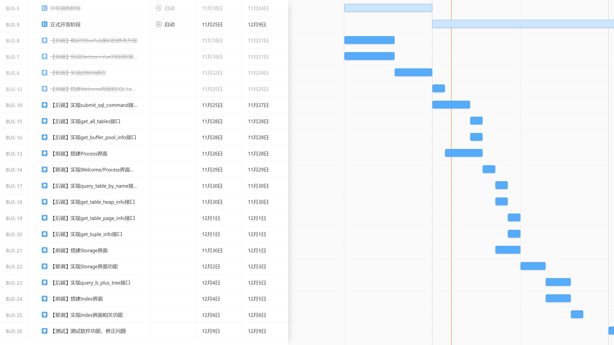

# BusTubTracer 详细进度计划

开发小组：A7小组（BusTubTracer Project）

编写日期：2024.11.26

# 进度计划梗概

## 技术储备&详细设计阶段

- 立项~第0周：
- - 核心开发人员大体完成有关数据库底层原理有关理论知识的学习，以及对BusTub开源代码的阅读分析。
- - 核心开发人员完成基本的技术选型、架构设计、后端接口设计以及前端UI设计，并撰写详细的设计文档。
- - 核心开发人员根据设计评审的反馈，设计文档进行完善修改。**原则上，除了补充和调整必要的细节外，在开发阶段不再对详细设计文档进行任何变动！**

## 开发阶段

- **开发预热阶段**：通过设计评审~第1周（2024.11.18~2024.11.24）
- - 核心开发人员分别完成前后端的代码框架搭建，并及时处理在此过程中碰到的技术问题，为后面快速推进业务内容的开发实现奠定基础。
- - 这一周内的关键任务，在于确保能够实现前文"整体技术架构"中提及的**进程间通信**功能，以及**设计一个简单的自动化测试脚本，能够方便地对BusTubCore的后端接口进行批量自动化测试**。
- **实际开发阶段**：第1周~第3周（2024.11.25~2024.12.9）
- - 后端开发人员依据详细设计文档，修改BusTub源代码，完成后端接口实现。同时，在开发过程中需要穿插为每个接口编写测试样例的工作。
- - 前端开发人员依据详细设计文档，完成前端交互页面的实现。
- - 当某个功能的前端界面和后端接口均施工完毕后，由王江轶和徐翊蓝同学及时完成前后端联调，确保后端能够正确响应前端请求并返回数据，前端能够正确渲染后端返回的数据并响应用户的交互操作。

## 测试与完善阶段

- 第4周（2024.12.9之后）
- - 测试人员负责在本机上对产品应用进行测试，及时反馈出现的问题，并丰富补充开发阶段由开发人员编写的测试样例。

# 详细任务拆分与排期

详细任务拆分与排期见如下的甘特图：

