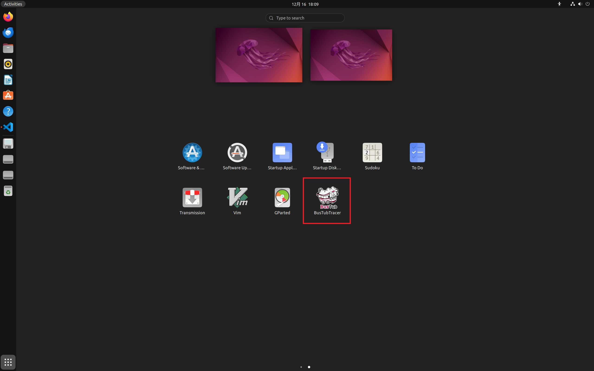
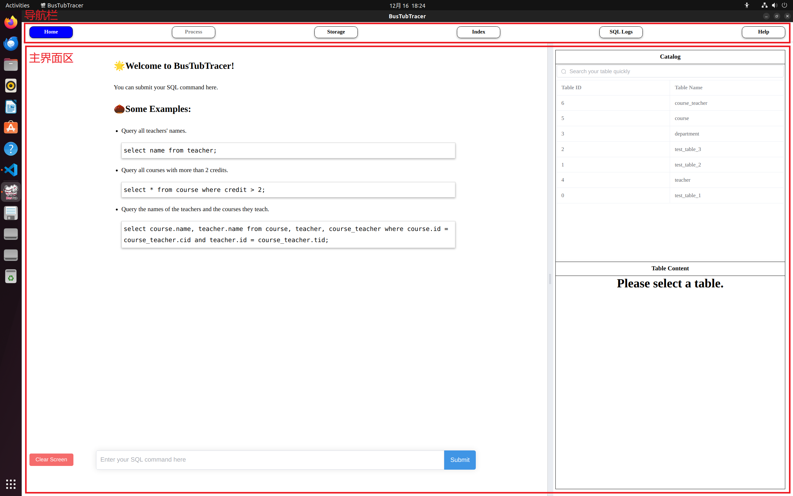
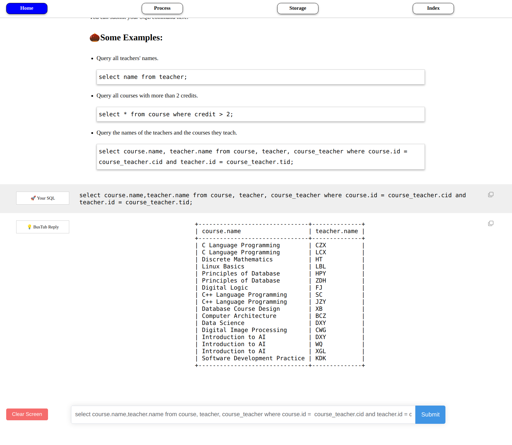
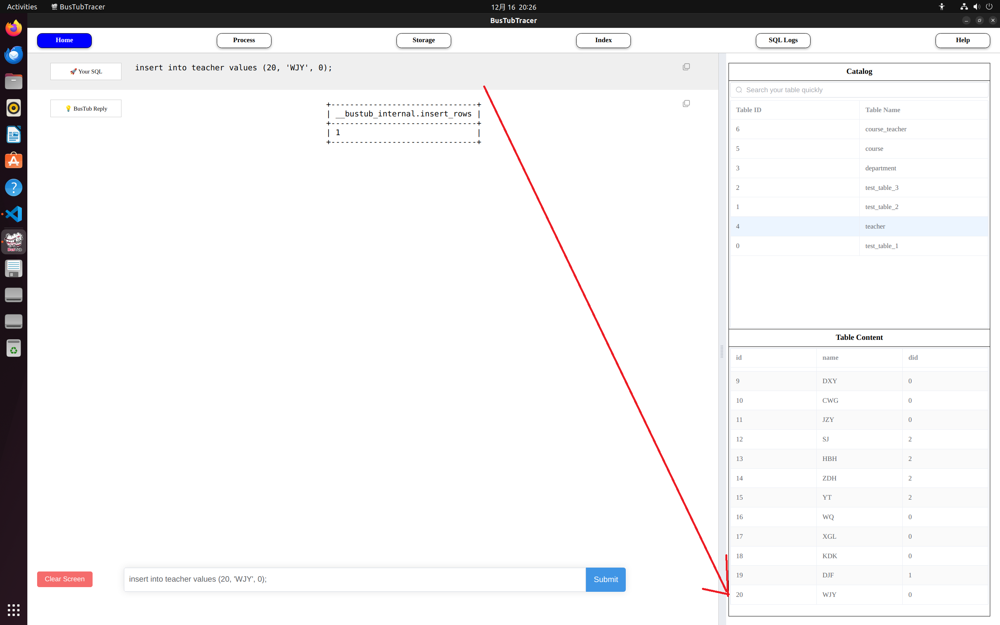
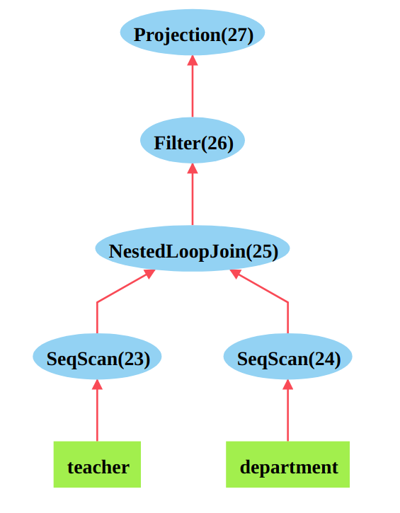
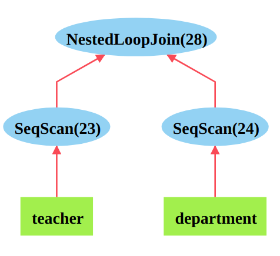
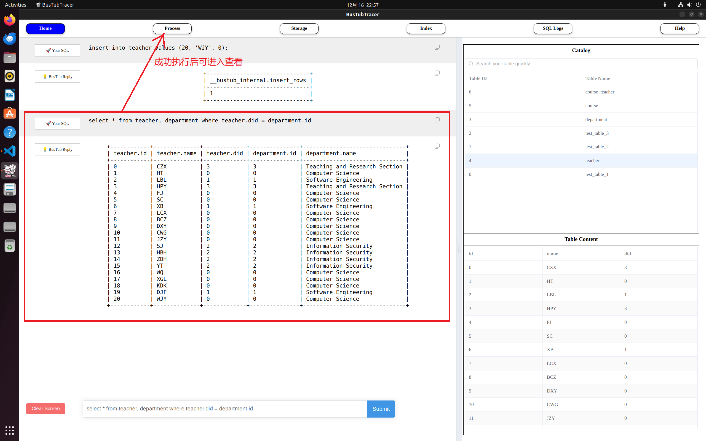
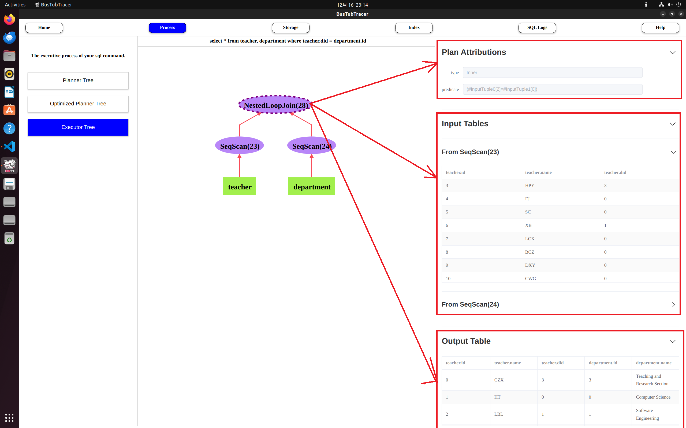

# BusTubTracer 用户手册

开发小组：A7小组（BusTubTracer Project）

编写日期：2024.12.16

# 前言

## 什么是BusTubTracer

BusTubTracer是一款基于BusTub开发的关系型数据库管理系统（RDBMS）底层工作原理和内部数据结构的可视化工具，旨在帮助初学RDBMS底层原理（尤其是[CMU-15445/645课程](https://15445.courses.cs.cmu.edu/)）的计算机类专业学生更好地掌握RDBMS系统设计与实现中的关键概念。

[BusTub](https://github.com/cmu-db/bustub)是由[Carnegie Mellon University](https://www.cs.cmu.edu/)推出的一款开源教学型RDBMS系统。该系统仿照实际的商用RDBMS系统，实现了简单SQL查询、索引等基本功能，是计算机专业学生学习RDBMS底层设计实现和工作原理的宝贵资源。

BusTubTracer基于原版BusTub进行二次开发，在原版的基础上增加了可视化图形界面，用于直观展示BusTub内部的一些重要数据结构，以及BusTub针对SQL命令的处理和执行过程。

## 本手册的目的

作为用户手册，本手册中我将主要介绍BusTubTracer的安装方法和各主要界面的基本操作。

此外，针对先前缺乏数据库原理相关背景知识和不熟悉BusTub的新手用户，我还特别在每个界面的介绍章节中提供了相关技术背景的介绍，以帮助这部分用户快速上手。

# 安装与启动BusTubTracer

## 安装

与原版BusTub一样，BusTubTracer运行在Ubuntu系统上（推荐使用Ubuntu 22.04）。因此如果你的电脑安装的是Windows系统，那么需要首先在VMware等虚拟化软件中安装Ubuntu系统，再进行BusTubTracer软件的安装。

BusTubTracer以`.deb`格式的安装包形式分发给用户，其安装和卸载非常简单。

安装命令：

```shell
sudo dpkg -i <deb安装包路径>
```

卸载命令：

```shell
sudo dpkg -r BusTubTracer
```

## 启动

成功执行`dpkg -i`命令后，如下图所示，在Ubuntu系统的`Show Applications`界面中找到BusTubTracer的应用图标，然后点击启动即可。



软件启动后，默认会进入如下界面。其中上方的五个按钮共同组成导航栏，下方的大区域则为主界面区。你可以通过导航栏实现软件主界面之间的切换。



在用户手册接下来的部分，我将向你逐一介绍导航栏所对应的五个主界面各自的功能和操作方法。

此外我还需要告诉你的是，在你启动BusTubTracer的时候，它就会启动为你启动BusTub数据库，并与之建立连接，整个过程无需你的干预。

同时，为了降低上手难度，BusTubTracer也会在启动时，预先在数据库中自动为你创建若干张体验用的数据表。具体如下：

| 表名              |      字段                                     |  内容说明                                                     |
|----------         |-------------                                  |------                                                        |
| department        |   (id int, name varchar(128))                 | 计算机学院的各个系室                                           |
| teacher           |   (id int, name varchar(128), did int)        | 计算机学院各个教师的姓名和所属系室                              |
| course            |   (id int, name varchar(128), credit int)     | 计算机学院开设的各门课程及其学分                                |
| course_teacher    |   (cid int, tid int)                          | 多对多连接表，计算机学院开设的课程各由哪些老师任教                |
| test_table_1      |   (colA int, colB int, colC int, colD int)    | 共40条记录，colA字段的取值顺次为0~39，其余各个字段用随机数填充    |
| test_table_2      |   (colA int, colB int, colC int, colD int)    | 共80条记录，colA字段的取值顺次为0~80，其余各个字段用随机数填充    |
| test_table_3      |   (colA int, colB int, colC int, colD int)    | 共400条记录，colA字段的取值顺次为0~400，其余各个字段用随机数填充  |


# Home界面介绍

## 界面操作说明

Home界面由左右两部分组成，其中右侧部分为一个可以使用鼠标左右拖拽的侧边栏。

左侧为主控制台区，你可以在该区域下方的输入框中直接输入你想提交到数据库执行的SQL命令，并敲击键盘回车或者单击Submit按钮即可。

为了方便初学者上手，我们也在主控制台的欢迎信息中提供了一些示例SQL命令。你可以直接点击这些示例命令，此后相应的命令会被直接填充到下方输入框中。

当命令执行成功后，如下图所示，主控制台区会立即显示出SQL命令的查询结果。



Home界面右侧的侧边栏提供了快速查看当前数据库中已有数据表，以及每张数据表中已有内容记录的功能。这个操作比较简单，就不多介绍了。

我这里需要告诉你的是，每当数据库中数据表或其中的记录发生变化时，侧边栏中显示的信息都会实时发生变化。例如下图，当我向`teacher`表中新插入一条记录时，若侧边栏恰好选中`teacher`表，则其中显示的该表记录将自动发生更新。



假如你是SQL语言初学者，通过这个特性，你可以通过实时观察侧边栏中显示内容的方式，来方便地了解你执行的SQL命令会对数据表中的内容产生何种影响，进而加深你对SQL语言的掌握。

# Process界面介绍

## 技术背景介绍：BusTub的Query Executor Layer工作原理

Process主界面主要用于展示BusTub中执行层（Query Executor Layer）是如何处理和执行你所提交的SQL命令的。在介绍该界面的操作方法之前，为了便于你理解该界面中所会展示的内容，我首先需要简单向你介绍一下BusTub执行层的工作原理。

在BusTub中，首先会对文本形式的SQL命令进行语法解析，将其转换为抽象语法树（AST树）。随后，会对AST树进行扫描，得到初步的查询计划树（Planner Tree）。

例如，对于如下的SQL命令：

```sql
select * from teacher, department where teacher.did = department.id;
```

BusTub会生成如下的查询计划树：



要理解查询计划树所表达的涵义，你首先需要理解"数据流向"的概念。从图中你可以观察到，查询计划树的叶子节点即为SQL命令中要进行查询的那两张数据表。它们上方的箭头即表示数据（记录）从数据表中流出，流入箭头所指的节点当中，并且会在这些节点中被进一步处理，而处理后的数据又会进一步流入当前节点箭头所指的上层节点当中。经过如此迭代，最终从查询计划树的根节点流出的那些记录，即为SQL命令的最终查询结果。

理解了查询计划树所表达的涵义，接下来我们来看看如何解读图中的这棵计划查询树。首先，树中最底层的两个`SeqScan`节点表示分别从两张表中逐个读取记录。这些读取出来的记录最终会流入`NestedLoopJoin`节点。

`NestedLoopJoin`节点的作用在于对`SeqScan`节点所读取出的两张表进行等值连接（也称作内连接，Inner Join）。在不附加任何条件的情况下，等值连接的效果相当于对两张表作笛卡尔积。

例如，假设`SeqScan`节点读到的两张表的内容分别为

|id     |name   |did    |
|-----  |------ |------ |
|0      |KDK    |0      |
|1      |XB     |1      |

和

|id     |name                       |
|-----  |------                     |
|0      |Computer Science           |
|1      |Software Engineering       |

那么`NestedLoopJoin`节点的输出结果就应该是

|teacher.id     | teacher.name      | teacher.did       | department.id | department.name       |
|-----          |------             |------             | ---------     | --------              |
|0              |KDK                |0                  | 0             | Computer Science      |
|0              |KDK                |0                  | 1             | Software Engineering  |
|1              |XB                 |1                  | 0             | Computer Science      |
|1              |XB                 |1                  | 1             | Software Engineering  |

`NestedLoopJoin`节点输出的临时表会被继续向上推送给`Filter`节点。此节点会对临时表中的记录进行过滤，筛选出符合过滤条件的记录再次组成新的临时表，并继续向自己的父节点推送。

本例中`Filter`节点的过滤条件为`(#InputTuple0[2]=#InputTuple0[3])`，用自然语言表述就是"保留输入表格中（从0开始数的）第2个字段与第3个字段相同的记录"，这对应了你所输入的SQL命令中`where teacher.did = department.id`这部分内容。

因此`Filter`节点所输出的临时表就是

|teacher.id     | teacher.name      | teacher.did       | department.id | department.name       |
|-----          |------             |------             | ---------     | --------              |
|0              |KDK                |0                  | 0             | Computer Science      |
|1              |XB                 |1                  | 1             | Software Engineering  |

根节点`Projection`执行投影操作，即对输入表中每条记录仅保留特定的某几个字段，然后作为新的临时表输出。本例中`Projection`节点的投影表达式为`[#InputTuple0[0], #InputTuple0[1], #InputTuple0[2], #InputTuple0[3], #InputTuple0[4]]`，翻译成自然语言就是"投影输入表中的第0、1、2、3和4字段"，这对应于你输入的SQL命令中的`select *`这部分内容。

> 如果你足够敏锐，应该注意到无论是`Filter`节点还是`Projection`节点，都会有一些表达式之类的信息附着在它们上面。事实上，在BusTub中各种不同类型的节点都会被附着一些特定的信息，即节点的**属性（attribution）**。在附录中，我列举了每一种节点上所可能附加的属性，你可以在学习BusTub的过程中随时进行查阅。

至此你应该已经基本理解了查询计划树的工作原理。

同时，你或许也注意到了一些问题：
- 树中的`Projection`节点似乎没有存在的必要，因为SQL命令中写的是`select *`，并不需要手工去掉某些字段再输出最终结果。
- 既然需要对`NestedLoopJoin`节点输出的结果再次进行过滤，那么能否直接在该节点作等值连接操作时，就执行原本属于`Filter`父节点的过滤条件？

这两个问题的答案都是Yes。

实际上，诸如此类的问题就属于SQL查询优化的范畴了。在BusTub中，也实现了简单的查询优化器。虽说叫"查询优化"，实则是对前面介绍的查询优化树进行优化，而优化可能具体表现为消除冗余节点、用执行效率更高的具备等效功能的节点替换掉原节点等多种形式。

以下展示了BusTub中优化器对前述执行计划树优化的结果，即所谓的Optimized Planner Tree：



到此BusTub中Query Executor Layer的基本原理就介绍得差不多，但必须说明的是，在BusTub的真实实现中，在完成查询优化后，实际上还会遍历整一颗优化查询计划树，生成相应的执行器树（Executor Tree）。执行器树上的每一个节点都对应于优化查询计划树上的某一个节点，并维护一个指针指向它，如下图所示。


最终实际实现的Query Executor Layer会从根节点开始，自顶向下递归整一棵执行器树，并按递归顺序调用挂载在每一个执行器节点上的操作函数来实现对临时表中数据的处理。

每一个执行器节点操作函数都需要依据对应查询计划树上的某些属性来执行。例如，`Filter Executor`节点就需要根据对应`Filter Planner`节点上挂载的`prediction`属性（过滤条件）来决定保留输入临时表中的哪些记录。

## 界面操作说明

BusTubTracer中上方导航栏Process按钮默认处于禁用状态。当你在Home界面的控制台中成功执行一条SQL命令后，该按钮会解锁。之后你就可以进入Process界面查看该条SQL命令的执行过程。



Process的界面如下图所示，其中左侧子面板为导航栏，你可以通过它来切换查看前面介绍的SQL命令执行的三个不同过程。中间子面板会显示当前执行阶段BusTub所生成的树状数据结构的可视化图示。你可以点击树上的任意节点，以查看挂载在该节点上的属性，这部分内容会在右侧子面板中展示。


> 你可能会注意到，中间面板每个节点上都会标记一个数字，这是该节点的ID号。在BusTub内部，会通过这个ID号来区分不同的节点。

如果你点击查看Executor Tree上的节点，那么在右侧子面板中显示的内容会更加丰富。除了其对应的Planner Node的属性外，还包括BusTub实际遍历执行整棵树时，流入该节点的临时表，以及从该节点流出的临时表。从根节点中流出的临时表，即为最终的查询结果。



> 如果你想要直观学习
> - BusTub中的查询优化策略：你可以对比各种复杂的SQL命令所生成的Optimized Planner Tree，相比原先的Planner Tree出现了哪些变化。
> - BusTub中Executor Tree上不同节点的具体功能：你可以对比流出该节点的临时表（Output Table），相较于流入该节点的临时表（Input Table），发生了哪些变化。

# Storage界面介绍

## 技术背景介绍：BusTub的Storage Layer工作原理

作为一个计算机软件，BusTub在处理数据表时，必须要将数据表加载到内存中进行处理。作为一名数据库原理的学习者，了解BusTub内部的存储层（Storage Layer）是如何在内存中存储和管理数据表，是十分必要的。

在介绍这个问题之前，我首先需要向你简单介绍一下BusTub中内存页（Page）的概念。一个内存页就是一块大小为4KB的内存空间。在BusTub启动时，首先会向操作系统申请若干份这样的内存空间，即申请若干张物理内存页，并按顺序为这些内存页进行编号（物理页号，也称作页框号，Frame ID）。物理内存页在BusTub中主要有两种用途，其一是用于存储数据表的数据，其二是用于存储数据表的索引信息。这里我将重点介绍前者，而后者将会放在后续章节中介绍。

> 4KB的大小对于可视化演示来说，显然太大了。因此在BusTubTracer的实现中，我们将一个内存页的大小限定为134B。作为弥补，在数据库系统启动时会向操作系统申请更多数量的物理内存页。

BusTub会通过内存池（Buffer Pool）来管理物理内存页的申请和释放。内存池中有一个所谓的空闲列表（Free List）的链表，用于管理所有的空闲的（即待分配的）物理内存页。当BusTub启动时，其向操作系统申请到的所有物理内存页都会被挂到空闲列表上。

之后在程序运行的过程中，空闲列表上的物理内存页可能会被分配出去，用于存储数据表数据或者索引。对于每一个被分配出去的物理内存页，都会被数据库系统分配一个逻辑页号（也称作虚拟页号，Page ID）。同时，数据库系统内部会维护一个名为Page Table的映射表，用于记录每个逻辑页号分别对应于哪个物理页号。每当一个新的物理内存页被分配出去并获得一个逻辑页号，Page Table映射表中就会新增加一条映射记录；反之，当某一个逻辑页被释放，除了其对应的物理页就会被数据库系统重新回收到空闲列表当中去，Page Table中相应的映射记录也会被剔除。

如果BusTub空闲列表中所有的物理内存页都已经被耗尽，而这时候数据库系统又想要申请更多的内存空间，那么BusTub会采用一定的页替换算法（在BusTubTracer的实现中为LRU-K），将某个不常用的已驻留在内存中的逻辑页所对应的物理页内的数据转储到硬盘上，并在Page Table中将相应的映射项标记为"数据已转储进硬盘"。经过转储后，该物理内存页就又空闲出来了，可以再次被分配出来，用于装载其他逻辑页所对应的数据。注意，这个转储过程是有前提的。如果某个物理页中并没有被写入过数据，即该页不是脏页（Dirty Page），那么也就没有进行转储的必要了。

当数据库系统想要访问的虚拟页已有对应物理页在内存中为其装载数据时，即在Page Table中可以通过虚拟页号找到合法的物理页号，那么直接访问内存中的这张物理页即可。另一方面，当数据库系统想要访问对应数据被转储进硬盘的虚拟页时，它首先会从Page Table中得知数据已被转储这件事，随后会从空闲列表中申请一个物理页并将硬盘中的数据读取进这个物理页中，并且会更新Page Table中的映射项，将当前要访问的虚拟页号和新申请到的物理页号绑定起来。

如果你曾经学习过操作系统虚拟内存管理方面的知识，相信这部分介绍对你来说非常熟悉。

在基本了解了BusTub中内存页的概念后，让我们来看看BusTub是如何管理内存中的数据表数据的。

首先，在BusTub中有一个名为Catalog的结构体，数据库系统中一些重要的全局信息都会被挂在这个结构体上。在Catalog中会维护一个名为`tables`的映射表，维护数据表ID号（Table ID）和Table Info结构体的对应关系。Table Info结构体中包含了对应数据表的Schema、数据表名和ID号等元信息，同时也包含一个指向数据表核心存储结构体Table Heap的指针。

Table Heap是BusTub中用于管理数据表数据的核心结构。它本质上是一个存储了多个 Table Page的链表，每个Table Page可以看作是一个数据表的一部分存储单元。当我们向数据表中读写数据时，实际上是在对Table Heap中的某一个Table Page进行读写。

那Table Page又是个什么玩意儿呢？其本质就是上面我们介绍到的逻辑内存页！但是为了更好地实现数据库系统对数据表数据的存储和管理，BusTub的开发者又对Table Page的内部结构（内存布局）进行了更精细的规划。

每一个Table Page所对应的内存空间，被划分成了如下几个部分：
- **Page Header**：用于记录该页的元数据，例如：
    - page id：当前页的逻辑页号。
    - LSN（Log Sequence Number）：用于与日志系统配合，实现故障恢复。
    - prev page id / next page id：用于维护 table heap 中的双向链表结构，方便实现对数据表数据的顺序遍历。
- **Free Space**：Table Page中存在的未使用空间。
    - 每当新的记录（Tuple）被插入到表中时，系统会在当前页的Free Space中分配存储空间。
    - 当Free Space不足时，系统会申请一个新的物理页作为Table Page加入到 Table Heap中。
- **Inserted Tuples**：已经存储在当前Table Page中的Tuple。这些 Tuple按照插入的顺序存储在页中。

接下来，我再向你介绍一下Tuple的内部结构：
- RID（Record ID）：用于唯一标识Tuple的结构体，由其所在Table Page的page id，和在该页中的Slot Num（即当前Tuple为该页中的第几个Tuple）共同组成。
- Size：Tuple的大小。单位字节。
- Data：该部分实际存储数据表记录中的数据，由一系列Value结构体组成。每一个Value结构体中除了包括实际数据（value）外，还包括用于标识不同数据类型的类型标识符（type id）以及实际数据的总字节数（size）。

这里我想要重点向你介绍一下RID。在后续章节介绍BusTub索引机制时，我们还会再次碰到它。

BusTub的开发者通过引入RID的概念，简单地实现了对目标记录的快速查找。若已知某条目标记录的RID，想要快速查找到这条记录的数据内容，则只需先根据RID中的page id访问对应的Table Page，再根据RID中的Slot Num在该Table Page内部定位到目标的Tuple结构体即可。

## 界面操作说明

# Index界面介绍

## 技术背景介绍：BusTub的索引机制

## 界面操作说明

# SQL Logs界面介绍

## 界面操作说明

# 附录

## BusTub中常见的Planner Tree Node